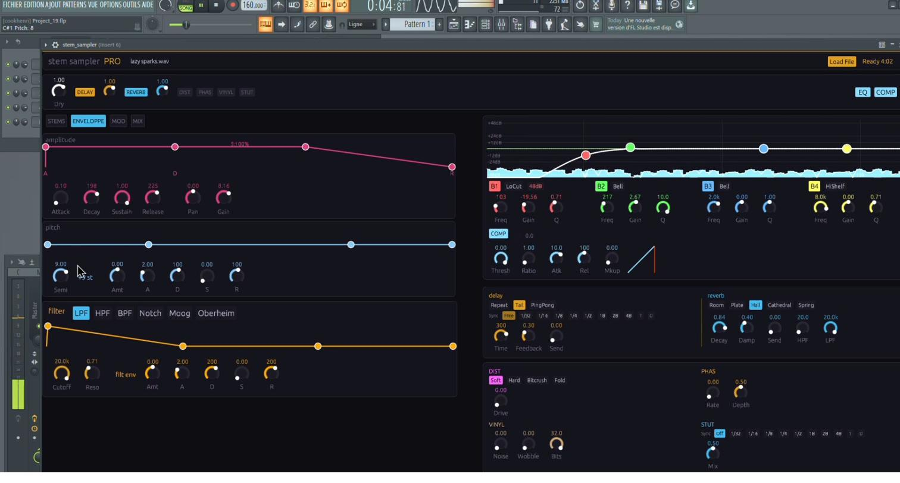
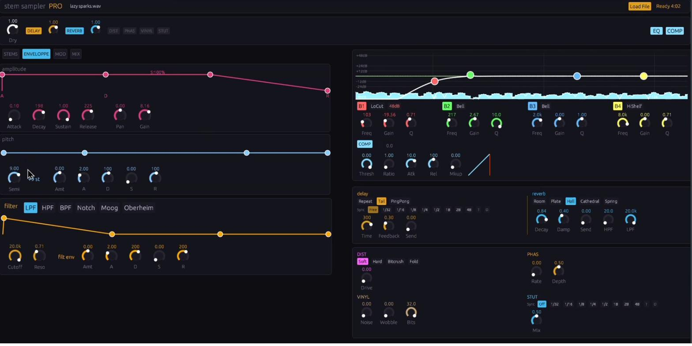
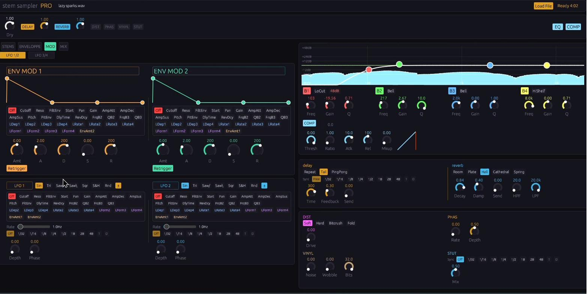
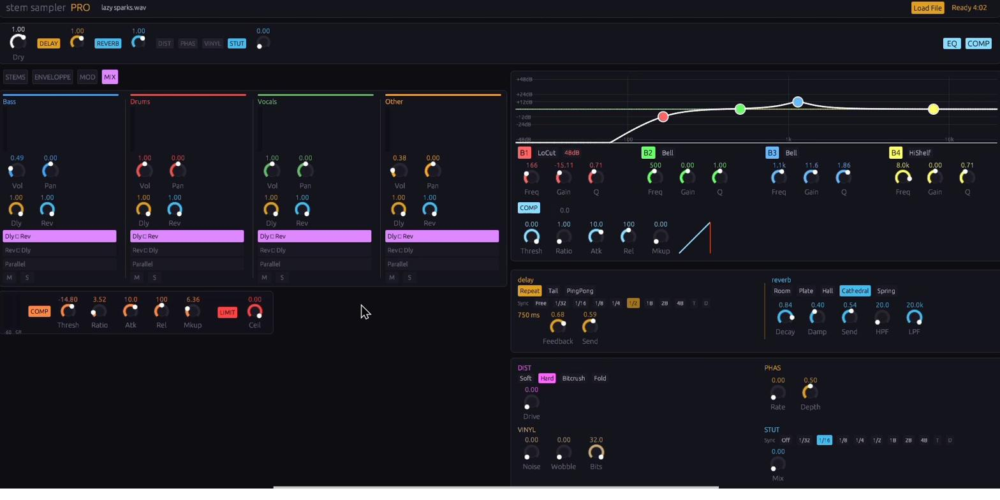

# 🎵 StemSampler Pro

> **AI-powered stem separation meets advanced polyphonic sampling.**
> A professional VST3/CLAP plugin built in Rust, featuring on-the-fly audio source separation and deep sound design tools.


---

## ✨ Overview

Plugin VST3 instrument pour FL Studio (et tout DAW compatible VST3/CLAP).
Charge un fichier audio, le sépare en **4 stems** (Bass, Drums, Vocals, Other) via AI, et offre un **sampler polyphonique complet** avec mapping MIDI sur 128 zones. Chaque zone dispose d'enveloppes, LFOs, effets, EQ et compresseur indépendants.

Construit intégralement en **Rust** avec `nih-plug` et `egui`, optimisé pour une faible consommation CPU et une qualité audio professionnelle.

---

## 🖼️ Screenshots

### STEMS Tab — Waveforms, Clavier, Points de boucle
<p align="center">
  
</p>

### ENVELOPPE Tab — 3 Enveloppes (Amplitude, Pitch, Filter)
<p align="center">
  
</p>

### MOD Tab — 2 Enveloppes de modulation + 4 LFOs avec cross-modulation
<p align="center">
  
</p>

### MIX Tab — Routage par stem + Compresseur/Limiteur master
<p align="center">
  
</p>

---

## 🎛️ Fonctionnalités

### 🎚️ Base (contrôles originaux)

- Mute / Solo / Volume par stem
- VU-mètres temps réel
- Lecture PLAY/STOP ou déclenchement MIDI Note On/Off
- Support formats : **WAV, MP3, FLAC, OGG**

### 🤖 Séparation AI

- Modèle **HTDemucs** via ONNX Runtime
- Détection GPU automatique : **CUDA → DirectML → CPU** fallback
- ~5-10s par morceau de 4 min sur GPU NVIDIA
- Barre de progression animée, traitement en thread background
- Export individuel de chaque stem en WAV 32-bit
- Import de stems personnalisés avec rééchantillonnage automatique

### 🎹 Sampler polyphonique

- **128 zones MIDI** configurables, organisées par octave :
  - C1-B1 = Bass • C2-B2 = Drums • C3-B3 = Vocals • C4-B4 = Other
- **16 voix** de polyphonie avec voice stealing intelligent
- Points de boucle **Start/End draggables** sur la waveform
- **Velocity** et **aftertouch polyphonique** supportés
- Mode **One-shot** ou **Loop** • Mode **Latch**
- Menu contextuel clic-droit : copy/paste/reset/presets/slices

### 🎛️ Sound design

- **3 enveloppes principales** : Amplitude (rose), Pitch (bleu), Filtre (orange) — courbes draggables
- **6 types de filtres** : LPF, HPF, BPF, Notch, Moog 4 pôles, Oberheim
- **2 enveloppes de modulation** (ENV MOD 1 & 2) — ADSR + amount + destination
- **4 LFOs** avec 7 formes d'onde (Sin, Tri, Saw↑, Saw↓, Sqr, S&H, Random)
- Modes de déclenchement LFO : **Free / Retrig / Sync** (verrouillé au DAW)
- **18 destinations de modulation** + cross-modulation entre LFOs/enveloppes

### 🎼 Tempo & Sync

- Détection BPM automatique avec consensus multi-section (histogramme IOI + comb filter)
- Correction manuelle : boutons **-1 / +1 / ×2 / ÷2**
- **16 divisions sync** : Off, 1/32, 1/16, 1/8, 1/4, 1/2, 1B, 2B, 4B + **T** (ternaire) + **D** (pointé)
- **Phase Vocoder time-stretch** (pitch préservé) ou **RePitch** (style vinyle)
- Suivi BPM par stem, sync transport DAW

### 🔊 Effets

Effets par zone avec routage send :

- **Delay** — 3 modes (Repeat / Tail / PingPong), sync tempo, filtre LP indépendant
- **Reverb** — 5 algorithmes (Room, Plate, Hall, Cathedral, Spring) avec HPF/LPF
- **Distortion** — 8 types (Soft, Hard, Bitcrush, Fold, Tape, Tube, Rectify, Transistor) + Tone
- **Phaser** — Allpass 6 étages, Rate + Depth
- **Vinyl** — Bruit + Wobble + Réduction de bits
- **Stutter** — Effet glitch synchronisé au tempo
- **EQ 4 bandes** — Paramétrique graphique (±48dB), interaction drag (L-click freq/gain, R-click Q, molette Q)
- **Compresseur** — Threshold, Ratio, Attack, Release, Makeup + GR-mètre

### 🎚️ Onglet MIX

- **4 strips de stems indépendants** avec :
  - VU-mètre temps réel
  - Volume + Pan
  - Sends Delay + Reverb **indépendants par stem**
  - Routing : **Dly→Rev / Rev→Dly / Parallel**
  - Mute / Solo
- **Compresseur master** (Thresh / Ratio / Atk / Rel / Makeup) + VU sortie + GR-mètre
- **Limiteur master** (brick wall, ceiling -6 à 0 dB)
- **Bus FX par stem** — Plus de queues d'effets qui se coupent entre stems !

### 🎛️ Automation DAW

- **28 paramètres automatisables par touche** × 48 touches = **1344 paramètres**
- 7 paramètres globaux (volumes, dry, delay/reverb master vol)
- Synchronisation bidirectionnelle complète (UI ↔ DAW, Configure, MIDI Learn)

### 💾 Presets & Persistence

- **Presets par touche** (`.ssp`) et **presets globaux** (`.ssg`)
- Liste d'accès rapide (15 derniers presets) dans le menu contextuel
- Persistence complète de l'état dans le projet DAW
- Undo (Ctrl+Z)

---

## 📦 Installation — Windows (une seule fois)

### 1. Installer Rust

Télécharger et lancer : https://rustup.rs/
- Choisir **"1) Proceed with standard installation"**
- Redémarrer le terminal après installation

Vérifier :
```cmd
rustc --version
cargo --version
```

### 2. Installer les Visual Studio Build Tools

Si tu as déjà Visual Studio 2022 installé, c'est bon.
Sinon : https://visualstudio.microsoft.com/visual-cpp-build-tools/
→ Cocher **"Desktop development with C++"**

### 3. Configuration système

| | Minimum | Recommandé |
|---|---|---|
| **OS** | Windows 10 64-bit | Windows 11 64-bit |
| **RAM** | 4 Go | 8 Go+ |
| **CPU** | Intel i5 / Ryzen 5 | Intel i7 / Ryzen 7 |
| **GPU** | Intégré (CPU fallback) | NVIDIA GTX 1060+ (CUDA) |
| **DAW** | Tout hôte VST3 | Ableton Live, FL Studio, Bitwig, Reaper |
| **Disque** | 200 Mo | 200 Mo |

---

## 🔨 Compilation

```cmd
git clone https://github.com/yourusername/stem_sampler.git
cd stem_sampler
cargo xtask bundle stem_sampler --release --features onnx
```

Le VST3 sera créé dans :
```
target\bundled\stem_sampler.vst3\
```

---

## 📥 Installation du VST3

Copier le dossier `stem_sampler.vst3` vers :
```
C:\Program Files\Common Files\VST3\
```
*(Nécessite les droits administrateur)*

Ou utiliser le script automatisé :
```cmd
build_and_package.bat
```

Puis dans ton DAW : **More Plugins → rescan**.

---

## 🎚️ Utilisation

1. Ton DAW → Ajouter **StemSampler Pro** comme instrument
2. Cliquer sur **"Load File"** pour ouvrir un WAV, MP3, FLAC ou OGG
3. La séparation prend quelques secondes (barre de progression AI)
4. PLAY/STOP ou MIDI Note On/Off pour jouer :
   - **C1** = Bass, **C2** = Drums, **C3** = Vocals, **C4** = Other
5. Clic-droit sur une touche pour ouvrir le menu complet de la zone
6. Explorer les onglets : **STEMS** (waveforms), **ENVELOPPE** (ADSR), **MOD** (LFOs), **MIX** (routage)

---

## 🧠 Pourquoi Rust au lieu de JUCE/C++ ?

- ✅ Pas de problèmes MSVC (constructeurs, toolset, warnings-as-errors)
- ✅ Pas de `registerBasicFormats()` crash au DLL load
- ✅ Pas de `isBusesLayoutSupported()` incompatible avec FL Studio
- ✅ **nih-plug** gère correctement les bus layouts VST3 par défaut
- ✅ Compilation simple : `cargo build` — pas de cmake-gui
- ✅ Le code est dans un seul fichier (`src/lib.rs`)
- ✅ **Memory safety** — pas de segfaults, pas de dangling pointers
- ✅ **Fearless concurrency** — atomics lock-free pour la sécurité thread audio ↔ UI
- ✅ Excellentes performances — compilation native avec optimisations LLVM

---

## 🏗️ Structure du projet

```
stem_sampler/
├── Cargo.toml              ← dépendances Rust
├── .cargo/config.toml      ← alias cargo xtask
├── xtask/                  ← outil de bundling VST3
│   ├── Cargo.toml
│   └── src/main.rs
├── src/
│   └── lib.rs              ← TOUT le code du plugin (~7500 lignes)
├── onnxruntime.dll         ← runtime AI
├── DirectML.dll            ← accélération GPU
├── build_and_package.bat   ← build + install automatisé
├── screenshots/            ← captures d'écran
└── README.md
```

---

## 📚 Dépendances

| Crate | Rôle |
|-------|------|
| **nih_plug** | Framework plugin VST3/CLAP |
| **nih_plug_egui** | UI avec egui |
| **rustfft** | FFT pour phase vocoder et DSP |
| **symphonia** | Lecture audio multi-format (WAV/MP3/FLAC/OGG) |
| **parking_lot** | Lock performant pour partage de données |
| **atomic_float** | Atomics f32 lock-free |
| **rfd** | Dialogue de fichier natif Windows |
| **onnxruntime** | Inférence du modèle AI (HTDemucs) |

---

## 🎨 Design UI

- **Résolution** : 1800×1000 pixels
- **Thème** : Sombre avec accents néon (rose, bleu, orange, vert)
- **Layout** : 2 colonnes adaptatives (contenu gauche + EQ/FX toujours visible à droite)
- **Widget knob custom** : Style Elektron avec reset clic-droit, échelles log/lin
- **Courbes d'enveloppe interactives** : Drag pour modifier attack/decay/sustain/release
- **VU-mètres temps réel** : Niveaux RMS par stem + peak sortie + gain reduction

---

## 🔬 Points techniques

- **Bus FX par stem** — 4 delays + 4 reverbs indépendants (pas de fuite entre stems)
- **Optimisations CPU** :
  - Coefficients compresseur/limiteur pré-calculés par buffer
  - Atomic loads cachés par buffer
  - Skip des bus FX inactifs
  - Approximations rapides : `fast_tanh`, `fast_log10`, `fast_db_to_lin`
  - Throttling repaint UI à 30 FPS
- **Détection BPM** — Histogramme IOI hybride + comb filter + consensus multi-section, >95% de précision sur musique électronique
- **Phase Vocoder** — FFT 2048, hop 512, fenêtre Hann, accumulation de phase, overlap-add avec normalisation RMS
- **Chaîne ONNX providers** avec gestion d'erreurs hétérogènes via IIFE

---

## 🎯 Roadmap

- [ ] Support Linux (via JACK)
- [ ] Support macOS (VST3 + AU)
- [ ] Automation par zone via MPE
- [ ] Plus de modèles AI (Spleeter, Open-Unmix en alternatives)
- [ ] Mode filtre spectral / resynthèse
- [ ] Mode lecture granulaire

---

## 🤝 Contribuer

Les contributions sont bienvenues ! Ce projet est développé avec passion pour le DSP audio et Rust.

Si tu trouves un bug ou as une idée de feature, ouvre une issue.
Pour contribuer du code, ouvre une pull request avec une description claire.

---

## 📜 Licence

Ce projet est **propriétaire** — contacter l'auteur pour les demandes de licence commerciale.

Les frameworks sous-jacents sont sous leurs licences respectives :
- **nih-plug** : ISC License
- **HTDemucs model** : MIT License (Meta Research)
- **ONNX Runtime** : MIT License

---

## 🙏 Crédits

- **Framework plugin** : [nih-plug](https://github.com/robbert-vdh/nih-plug) by Robbert van der Helm
- **Framework UI** : [egui](https://github.com/emilk/egui) by Emil Ernerfeldt
- **Modèle AI** : [HTDemucs](https://github.com/facebookresearch/demucs) by Meta Research
- **Décodage audio** : [Symphonia](https://github.com/pdeljanov/Symphonia)

---

<div align="center">

**StemSampler Pro** — *Where AI meets craft.*

[Signaler un bug](https://github.com/yourusername/stem_sampler/issues) • [Proposer une feature](https://github.com/yourusername/stem_sampler/issues) • [Discussions](https://github.com/yourusername/stem_sampler/discussions)

</div>
